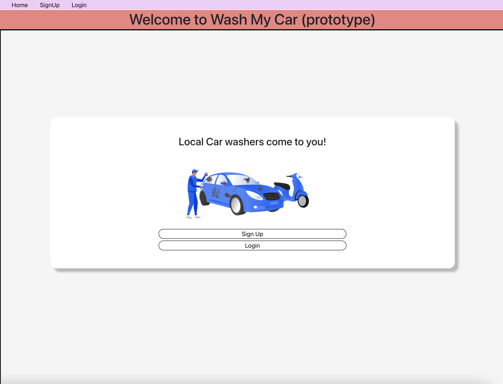

# Walk My dog - Connecting Dog Owners with Dog Walkers

## Table of contents

-   [Overview](#overview)
    -   [Screenshot](#screenshot)
    -   [Links](#links)
-   [The process](#the-process)
    -   [Built with](#built-with)
    -   [Key Learnings](#key-learnings)
    -   [Continued development](#continued-development)
    -   [Useful resources](#useful-resources)
-   [Authors](#authors)

## Overview

The basic concept of this website is to allow vehicle owners to list their cars to be washed by car washers. Car owner's list their vehicles and pay a set price for each vehicle type. Car washers can view what jobs are available and lock-in a particular date/time-slot.

### Screenshot

### Links

-   Solution URL: []
-   Solution Code Frontend: [https://github.com/mistergjones/washmycarfrontend]
-   Solution Code Backend: [https://github.com/mistergjones/washmycarbackend]

## The process

-   Established the idea.
-   Whiteboard / developed UI flows.
-   Create database table structure (normalised).
-   Identify key technologies (i.e. Axios, Node.js, Cloudinary, Bcrypt) that will for part of the solution.

### Built with

-   Semantic HTML5 markup
-   React (for Frontend)
-   JavaScript / Node.js (for WAF)
-   Database (Postgres for storing data)
-   Axios / APIs (for GETing and POSTing data)
-   Lottie (for animated pics)
-   Custom functions
-   Bcrypt (for encryption)
-   ReCharts (for charting)
-   JWT (for website cookies)
-   Cloudinary (for image storage)
-   bingMaps (address search location)

### Key Learnings

-   The use of "Rechart.js" for charting capabilities was used. However, it does not provide a solution for having labels and %'s on a pie chart. This was no show stopper but would need to utilise another package should i wish to use this type of functionality.

-   BingMaps API has a lot of API functionality. You can use its features to quickly auto-complete on an address search and populate the appropriate text boxes.

-   Utilising GEO-codes to calculate distances between Car Owners & Car Washers was achieved as BingMaps automatically provides Latitutude and Longitude information when a user signs up.

### Continued development

-   Integration with Stripe for payments as per Walk My Dog website.

## Authors

-   Glen Jones - [https://www.glenjones.com.au]
